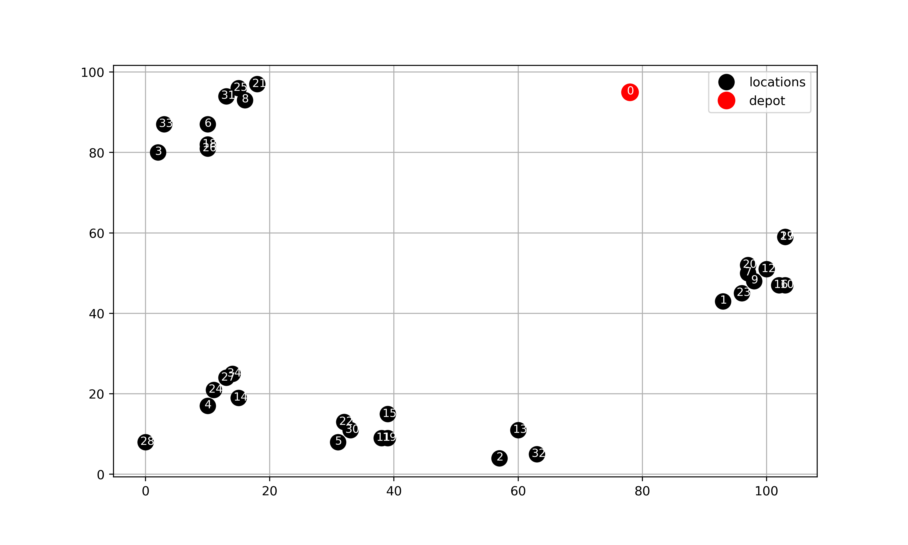
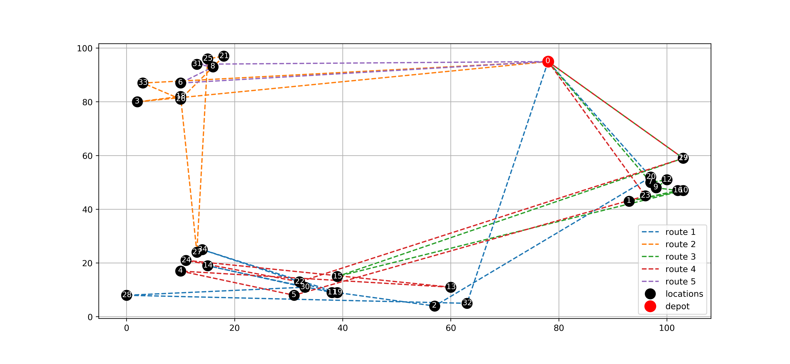
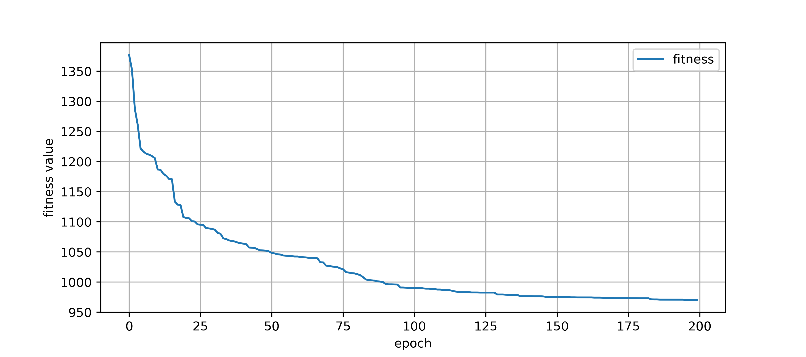
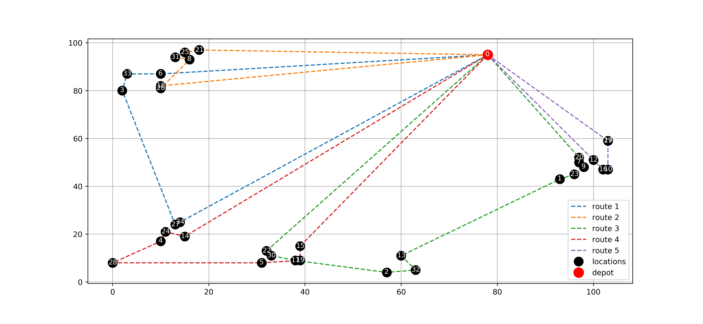

# VehicleRoutingProblem

The research work on Capacitated Vehicle Routing Problem (C-VRP) solving via Artificial Bee Colony (ABC) Algorithm which enhanced with *Local Search*.

---
**Problem example:**

**Random solution:**

**Fitness function of ABC:**

**And solution (200 epochs):**

**Reference**:
[An artificial bee colony algorithm for the capacitated
vehicle routing problem](http://citeseerx.ist.psu.edu/viewdoc/downloa[d?doi=10.1.1.457.8027&rep=rep1&type=pdf)

# A-benchmarks

---
|    | benchmark     |   n_locations |   n_trucks |   capacity |   optimal_cost |   ABC_cost |   time (s) |     error | is_feasible   |
|---:|:--------------|--------------:|-----------:|-----------:|---------------:|-----------:|-----------:|----------:|:--------------|
|  0 | A-n32-k5.vrp  |            32 |          5 |        100 |            784 |    793.689 |    34.4186 | 0.0123585 | True          |
|  1 | A-n33-k5.vrp  |            33 |          5 |        100 |            661 |    677.849 |    33.94   | 0.0254898 | True          |
|  2 | A-n33-k6.vrp  |            33 |          6 |        100 |            742 |    789.651 |    35.5225 | 0.0642203 | True          |
|  3 | A-n34-k5.vrp  |            34 |          5 |        100 |            778 |    890.053 |    34.7679 | 0.144027  | True          |
|  4 | A-n36-k5.vrp  |            36 |          5 |        100 |            799 |    902.63  |    39.6765 | 0.129699  | True          |
|  5 | A-n37-k5.vrp  |            37 |          5 |        100 |            669 |    722.61  |    40.3947 | 0.0801341 | True          |
|  6 | A-n37-k6.vrp  |            37 |          6 |        100 |            949 |   1002.95  |    41.3557 | 0.0568444 | True          |
|  7 | A-n38-k5.vrp  |            38 |          5 |        100 |            730 |    796.663 |    39.2311 | 0.0913186 | True          |
|  8 | A-n39-k5.vrp  |            39 |          5 |        100 |            822 |    917.818 |    41.4462 | 0.116567  | True          |
|  9 | A-n39-k6.vrp  |            39 |          6 |        100 |            831 |   1039.23  |    46.8593 | 0.250572  | True          |
| 10 | A-n44-k6.vrp  |            44 |          6 |        100 |            937 |    987.494 |    51.036  | 0.0538888 | True          |
| 11 | A-n45-k6.vrp  |            45 |          6 |        100 |            944 |   1209.34  |    55.1767 | 0.281077  | True          |
| 12 | A-n45-k7.vrp  |            45 |          7 |        100 |           1146 |   1270.99  |    62.4989 | 0.109066  | True          |
| 13 | A-n46-k7.vrp  |            46 |          7 |        100 |            914 |   1030.53  |    73.3458 | 0.127491  | True          |
| 14 | A-n48-k7.vrp  |            48 |          7 |        100 |           1073 |   1195.6   |    71.0007 | 0.114257  | True          |
| 15 | A-n53-k7.vrp  |            53 |          7 |        100 |           1010 |   1151.61  |    82.1195 | 0.140208  | True          |
| 16 | A-n54-k7.vrp  |            54 |          7 |        100 |           1167 |   1331.5   |    86.6397 | 0.140958  | True          |
| 17 | A-n55-k9.vrp  |            55 |          9 |        100 |           1073 |   1147.89  |    98.8293 | 0.0697974 | True          |
| 18 | A-n60-k9.vrp  |            60 |          9 |        100 |           1354 |   1502.62  |   118.18   | 0.109762  | True          |
| 19 | A-n61-k9.vrp  |            61 |          9 |        100 |           1034 |   1398.01  |   129.125  | 0.352039  | True          |
| 20 | A-n62-k8.vrp  |            62 |          8 |        100 |           1288 |   1517.37  |   119.281  | 0.178084  | True          |
| 21 | A-n63-k10.vrp |            63 |         10 |        100 |           1314 |   1515.19  |   127.642  | 0.153113  | True          |
| 22 | A-n63-k9.vrp  |            63 |          9 |        100 |           1616 |   1959.36  |   131.052  | 0.212478  | True          |
| 23 | A-n64-k9.vrp  |            64 |          9 |        100 |           1401 |   1664.51  |   122.621  | 0.188088  | True          |
| 24 | A-n65-k9.vrp  |            65 |          9 |        100 |           1174 |   1558.45  |   133.355  | 0.327473  | True          |
| 25 | A-n69-k9.vrp  |            69 |          9 |        100 |           1159 |   1434.53  |   154.796  | 0.237731  | True          |
| 26 | A-n80-k10.vrp |            80 |         10 |        100 |           1763 |   2203.57  |   184.733  | 0.249898 | True

# B-benchmarks

---
|    | benchmark     |   n_locations |   n_trucks |   capacity |   optimal_cost |   ABC_cost |   time (s) |     error | is_feasible   |
|---:|:--------------|--------------:|-----------:|-----------:|---------------:|-----------:|-----------:|----------:|:--------------|
|  0 | B-n31-k5.vrp  |            31 |          5 |        100 |            672 |    706.569 |    20.9377 | 0.0514423 | True          |
|  1 | B-n34-k5.vrp  |            34 |          5 |        100 |            788 |    808.974 |    23.4713 | 0.0266171 | True          |
|  2 | B-n35-k5.vrp  |            35 |          5 |        100 |            955 |    996.195 |    24.5341 | 0.0431363 | True          |
|  3 | B-n38-k6.vrp  |            38 |          6 |        100 |            805 |    820.224 |    28.2701 | 0.0189118 | True          |
|  4 | B-n39-k5.vrp  |            39 |          5 |        100 |            549 |    567.277 |    26.7929 | 0.0332911 | True          |
|  5 | B-n41-k6.vrp  |            41 |          6 |        100 |            829 |    947.016 |    30.4575 | 0.142359  | True          |
|  6 | B-n43-k6.vrp  |            43 |          6 |        100 |            742 |    777.761 |    33.5126 | 0.0481955 | True          |
|  7 | B-n44-k7.vrp  |            44 |          7 |        100 |            909 |    985.969 |    36.6416 | 0.0846748 | True          |
|  8 | B-n45-k5.vrp  |            45 |          5 |        100 |            751 |    796.818 |    32.5534 | 0.0610096 | True          |
|  9 | B-n45-k6.vrp  |            45 |          6 |        100 |            678 |    768.834 |    37.3276 | 0.133974  | True          |
| 10 | B-n50-k7.vrp  |            50 |          7 |        100 |            741 |    763.865 |    41.6256 | 0.0308568 | True          |
| 11 | B-n50-k8.vrp  |            50 |          8 |        100 |           1312 |   1354.85  |    44.7541 | 0.0326566 | True          |
| 12 | B-n51-k7.vrp  |            51 |          7 |        100 |           1032 |   1124.62  |    42.9064 | 0.0897509 | True          |
| 13 | B-n52-k7.vrp  |            52 |          7 |        100 |            747 |    818.84  |    43.2389 | 0.0961716 | True          |
| 14 | B-n56-k7.vrp  |            56 |          7 |        100 |            707 |    792.316 |    47.4659 | 0.120674  | True          |
| 15 | B-n57-k7.vrp  |            57 |          7 |        100 |           1153 |   1555.21  |    66.0018 | 0.348837  | True          |
| 16 | B-n57-k9.vrp  |            57 |          9 |        100 |           1598 |   1740.66  |    57.6039 | 0.0892725 | True          |
| 17 | B-n63-k10.vrp |            63 |         10 |        100 |           1496 |   1775.97  |    75.6478 | 0.187143  | True          |
| 18 | B-n64-k9.vrp  |            64 |          9 |        100 |            861 |   1082.98  |    75.0857 | 0.257812  | True          |
| 19 | B-n66-k9.vrp  |            66 |          9 |        100 |           1316 |   1611.2   |    82.5796 | 0.224317  | True          |
| 20 | B-n67-k10.vrp |            67 |         10 |        100 |           1032 |   1206.82  |    86.4656 | 0.169402  | True          |
| 21 | B-n68-k9.vrp  |            68 |          9 |        100 |           1272 |   1442.81  |    67.5301 | 0.134288  | True          |
| 22 | B-n78-k10.vrp |            78 |         10 |        100 |           1221 |   1602.17  |    93.2046 | 0.312182  | True          |
